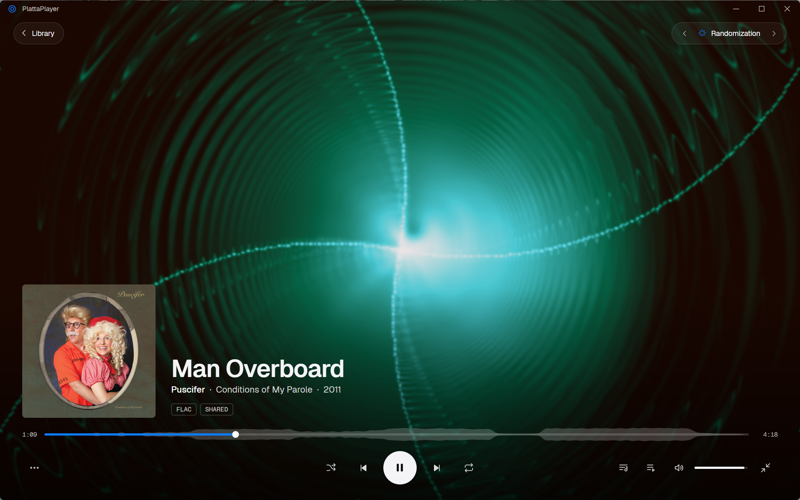
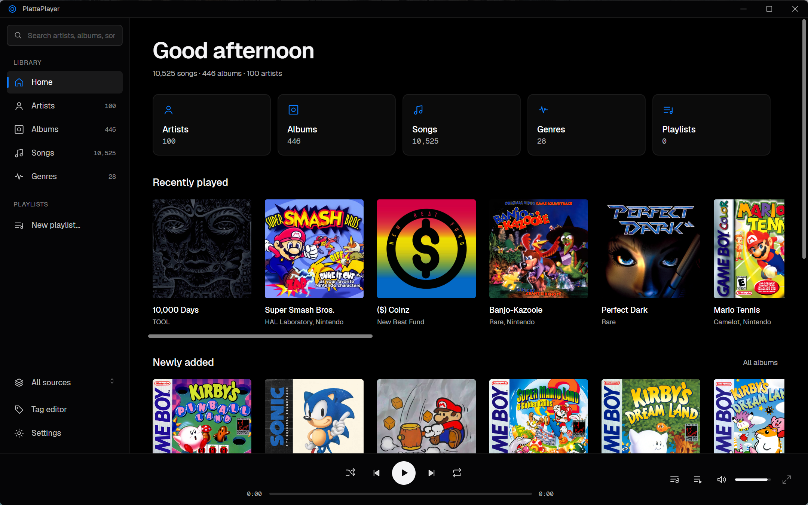
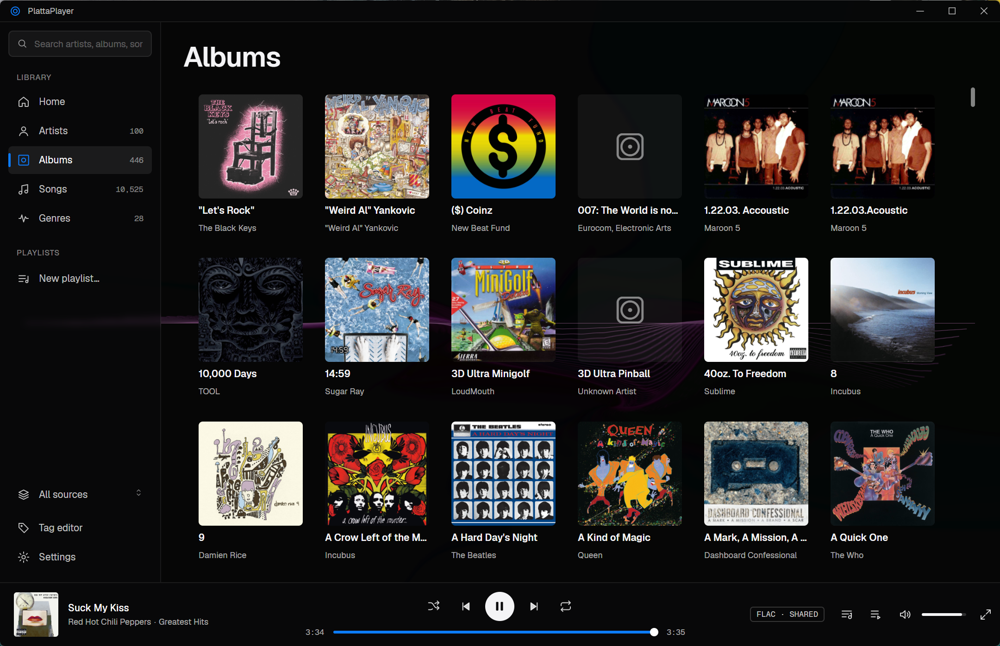
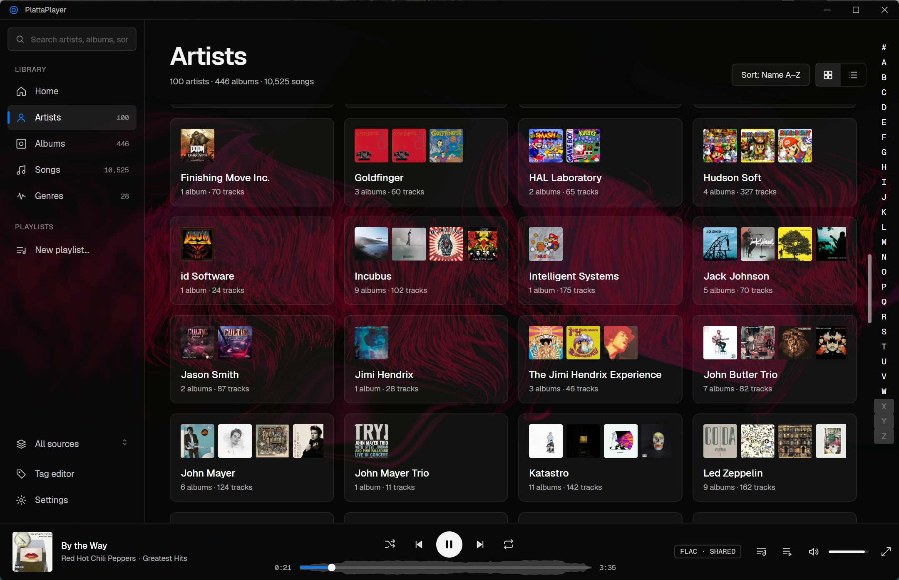
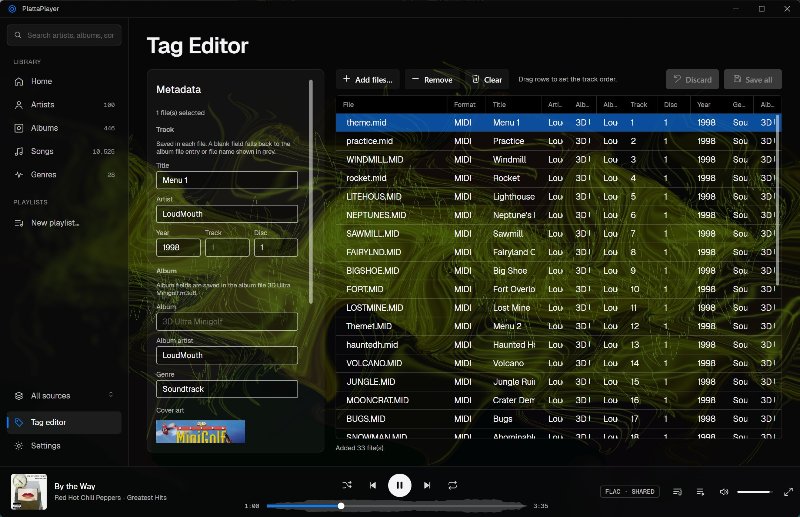
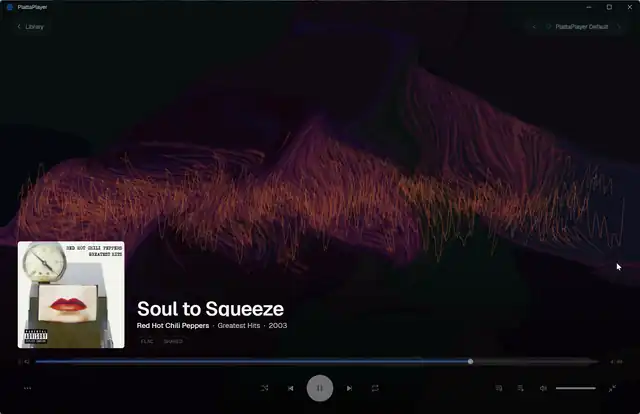
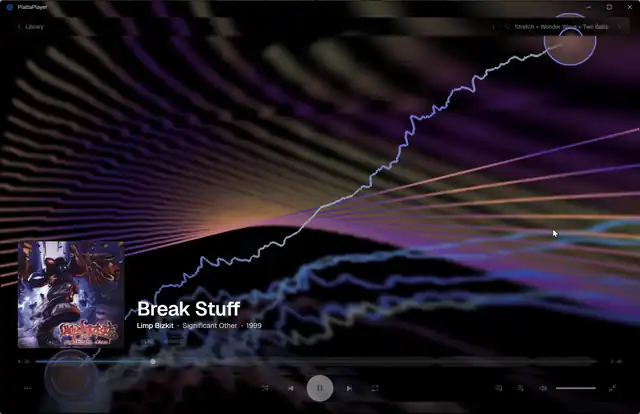
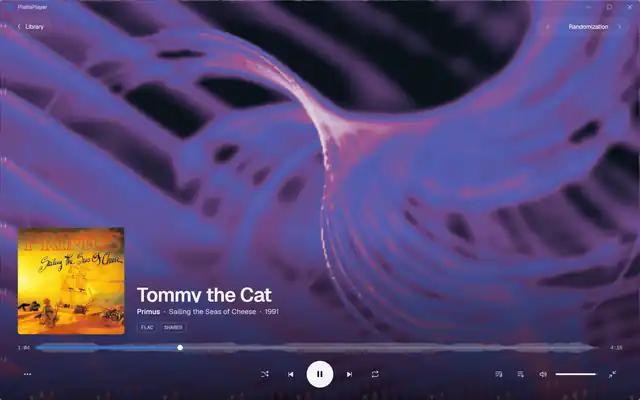
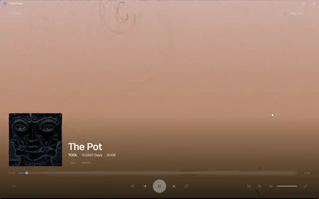

# PlattaPlayer

A modern desktop music player for Windows, written in C# targeting .NET 10 and Avalonia 12. PlattaPlayer aims to bring back the fun of music players with a focus on art and music visualizers. It also plays a wide range of music formats, from your more common audio codecs to MIDI and video-game music rips.

<p align="center">
  
</p>

<table>
  <tr>
    <td width="50%" align="center"><br><sub>Home</sub></td>
    <td width="50%" align="center"><br><sub>Albums</sub></td>
  </tr>
  <tr>
    <td width="50%" align="center"><br><sub>Artists</sub></td>
    <td width="50%" align="center"><br><sub>Tag editor</sub></td>
  </tr>
</table>

### Visualizers

<table>
  <tr>
    <td width="50%" align="center"><br><sub>MilkDrop</sub></td>
    <td width="50%" align="center"><br><sub>Windows Media Player: Alchemy</sub></td>
  </tr>
  <tr>
    <td width="50%" align="center"><br><sub>Windows Media Player: Battery</sub></td>
    <td width="50%" align="center"><br><sub>PSP</sub></td>
  </tr>
</table>

## Features

- **Sources:** local folders, plus Jellyfin, Plex, Emby and Navidrome (or any other Subsonic-compatible server, such as Airsonic or gonic).
- **Formats:** all standard formats (MP3, MP4, OGG, FLAC, etc.) plus these codec plugins:

  | Plugin | Formats | Engine |
  |---|---|---|
  | `Codecs.Midi` | MIDI | MeltySynth (SoundFonts), Windows MIDI devices, or emulated Roland SC / MT-32 modules (gearmulator 88emu) |
  | `Codecs.Spc` | SNES `.spc` | Managed port of ares' SPC700/DSP |
  | `Codecs.Usf` | N64 `.usf` / `.miniusf` | lazyusf2 (native) |
  | `Codecs.Gsf` | GBA `.gsf` / `.minigsf` | mGBA (native) |
  | `Codecs.Gbs` | Game Boy `.gbs` (with subsongs) | Managed port of SameBoy's APU |
  | `Codecs.Vgm` | `.vgm` / `.vgz` | libvgm (native) |

- **Visualizers:** a MilkDrop port, faithful ports of the Windows Media Player visualizations (Bars and Waves, Alchemy, Battery), and the PSP firmware visualizers.
- **Tagging:** a tag editor with staged edits and "Save all", including ID666/xid6 for SPC and PSF tags. M3U sidecar files supply the metadata for MIDI, GBS and VGM.
- **Integration:** custom window chrome, Windows media controls (SMTC), a play queue, lyrics and waveform seek.

### Keyboard shortcuts

| Key | Action |
|---|---|
| Space | Play / pause |
| Ctrl+← / Ctrl+→ | Previous / next |
| Ctrl+Enter | Toggle Now Playing |
| Ctrl+Q | Queue |
| Ctrl+L | Lyrics |
| Ctrl+F | Search |
| Ctrl+R | Restart the visualizer |
| [ / ] | Previous / next visualizer preset |
| Alt+← | Back |
| F11 | Full screen (Esc to leave) |

## Building

Requirements:

- .NET 10 SDK
- `bass.dll` (64-bit) from [un4seen.com](https://www.un4seen.com/), placed in `src/PlattaPlayer.App/native/`.

```powershell
dotnet build PlattaPlayer.slnx
dotnet run --project src/PlattaPlayer.App
```

The build stages the built-in visualizer and codec plugins into `plugins\<PluginName>\`, next to the exe.

### Optional native libraries

Four codecs depend on native emulators that aren't checked in. Without them, the app still runs: those files
show up with their tags but don't play, and the emulated MIDI devices don't appear. Each one has a
`build.ps1` under `native/`. The scripts need git, CMake and Visual Studio 2026 with the C++ workload (toolset
v145). Each script fetches a pinned upstream commit, builds it, and copies the DLL into its codec project.

| Script | Produces | Used by |
|---|---|---|
| `native/emu88/build.ps1` | `emu88.dll` | MIDI (emulated sound modules) |
| `native/lazyusf2/build.ps1` | `lazyusf2.dll` | USF |
| `native/mgbagsf/build.ps1` | `mgbagsf.dll` | GSF |
| `native/libvgm/build.ps1` | `ppvgm.dll` | VGM |

See each folder's README for details and the patches applied.

### Publishing

```powershell
# Folder build
dotnet publish src/PlattaPlayer.App -c Release -r win-x64 --self-contained -o publish/PlattaPlayer-win-x64

# Single-file build
dotnet publish src/PlattaPlayer.App -c Release -r win-x64 --self-contained `
  -p:PublishSingleFile=true -p:IncludeNativeLibrariesForSelfExtract=true -o publish/PlattaPlayer-win-x64-single
```

After publishing, copy the built plugins from `src/PlattaPlayer.App/bin/Release/net10.0-windows10.0.19041.0/win-x64/plugins` into the publish folder.

## User data

Everything lives under `%LOCALAPPDATA%\PlattaPlayer`:

- `SoundFonts\`: `.sf2` files for MIDI playback.
- `Roms\`: firmware dumps for the emulated MIDI modules (Roland SC-55/88/8850, MT-32…), the PSP firmware
  (`EBOOT.PBP`) for the PSP visualizers, and the YRW801 ROM for OPL4 VGMs. None of these are distributed with the app and are required for their respective playback or rendering.
- `plugins\`: third-party visualizer and codec plugins (drop-in DLLs built against
  `PlattaPlayer.Visualizations.Abstractions` / `PlattaPlayer.Codecs.Abstractions`).

## Repository layout

```
src/
  PlattaPlayer.App                    Avalonia desktop app (Windows head)
  PlattaPlayer.Core                   Models and platform-neutral interfaces
  PlattaPlayer.Data                   EF Core + SQLite library cache
  PlattaPlayer.Playback               BASS playback engine, waveform cache
  PlattaPlayer.Platform.Windows       SMTC and other Windows-specific code
  PlattaPlayer.Sources.*              Local, Jellyfin, Plex, Emby, Navidrome
  PlattaPlayer.Codecs.Abstractions    Codec plugin contract
  PlattaPlayer.Codecs.*               Codec plugins
  PlattaPlayer.Visualizations.*       Visualizer engines, their plugins and the plugin contract
  Shared/                             Source shared between projects (e.g. PSF parsing)
native/                               Build scripts for the native emulator DLLs
tools/                                Verification harnesses (codec output vs reference
                                      implementations, WMP visualizer ground truth), icon generator
```

## Licensing notes

- **BASS** is free for non-commercial use only. A commercial release needs a BASS licence.
- `emu88.dll` (GPL-3.0), `lazyusf2.dll` (GPL-2.0+) and parts of libvgm (GPL-2.0+) are loaded in-process.
- Each codec plugin ships a `THIRD-PARTY-NOTICES.md` for the code it ports or links.
